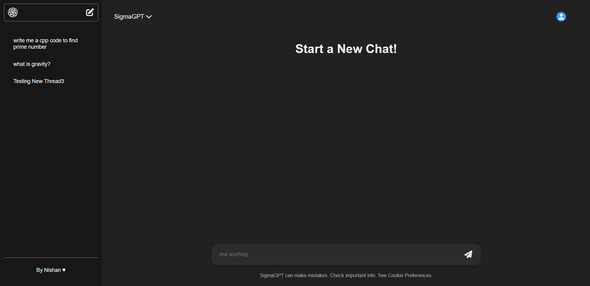
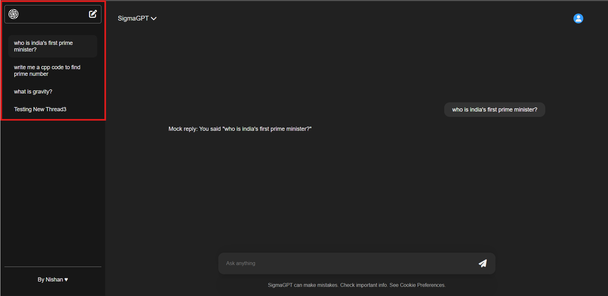
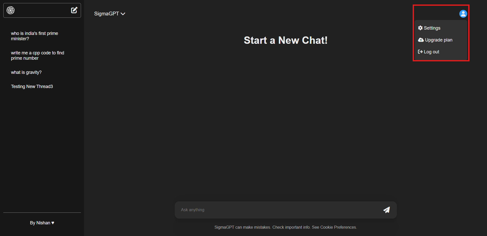

# SigmaGPT

A MERN based ChatGPT replica implemented from scratch using OpenAI.

---

## Features

### 1. Main Chat Interface

A clean and intuitive chat interface with a sidebar for thread navigation and a chat window for conversations.



---

### 2. Multi-Thread Chat Management

Manage multiple chat threads easily with the sidebar. Create new chats, switch between threads, and delete old conversations.



---

### 3. User Profile Dropdown

Access user settings, upgrade plans, and logout options through a user profile dropdown menu.



---

## Getting Started

Instructions to run the project locally:

### Backend

```bash
cd Backend
npm install
npm run dev
```

### Frontend

```bash
cd Frontend
npm install
npm run dev
```

Open your browser at `http://localhost:3000` to use SigmaGPT.

---

## Technologies Used

- React with Vite
- Node.js and Express
- MongoDB with Mongoose
- OpenAI API integration
- Markdown rendering with `react-markdown` and `rehype-highlight`

---

## Author

Nishan &hearts;
